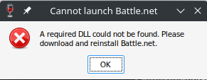
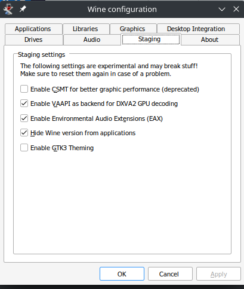
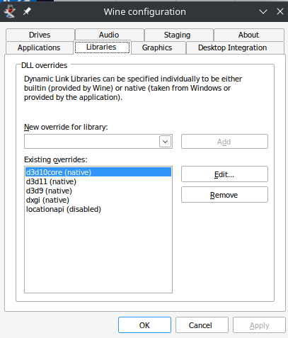

## GitHub Project
If you arrived here through GitHub Pages, be sure to checkout the actual [GitHub Project](https://github.com/CharacterBuilding/BattleNetOnKubuntu)
for any associated files, updates, questions, etc.

## Getting BattleNet Running on Kubuntu
With a shiny new laptop running `Kubuntu 22.04`, I wanted to be able to
occasionally play some Hearthstone on it. I was able to find some good
articles on how to do this via `Wine`, but none were complete, at least
for my version of Kubuntu/BattleNet.

### Installing/Configuring Wine and DXVK
First, we will need to install Wine. Based on the information I found, it
seemed like the latest "stable" `Staging` Branch would be the best bet for
running BattleNet and Blizzard Games on Wine.

#### Install Wine Staging
The most current information about Wine Staging can be found on the [Wine-Staging Wiki](https://wiki.winehq.org/Wine-Staging).
Like-wise, the most current installation instructions can be found on the [Wine Ubuntu Page](https://wiki.winehq.org/Ubuntu).

* Enabling 32-bit architecture on 64-bit systems
    * **NOTE** :: This is **not** necessary for this installation, but might be necessary for other things run in Wine.
    ```bash
    sudo dpkg --add-architecture i386
    ```
* Add the Wine Repository
    ```bash
    sudo mkdir -pm755 /etc/apt/keyrings
    sudo wget -O /etc/apt/keyrings/winehq-archive.key https://dl.winehq.org/wine-builds/winehq.key
    ```
* Download the Sources for `Ubuntu 22.04`
    ```bash
    sudo wget -NP /etc/apt/sources.list.d/ https://dl.winehq.org/wine-builds/ubuntu/dists/jammy/winehq-jammy.sources
    ```
* Install `Wine Staging`
    ```bash
    sudo apt install --install-recommends winehq-staging
    ```

##### Install DXVK Libraries
These libraries were supposedly not required to get Battle Net running in Wine, based on an old Reddit post, but I 
would continually get an error: `A required DLL could not be found. Please download and re-install Battle.net`



**NOTE** :: There may be more current installation instructions may be found on the 
[DXVK Project Page](https://github.com/doitsujin/dxvk)

* Download the latest Stable Release package from the [DXVK Project Page](https://github.com/doitsujin/dxvk/releases)
    * When this was written, it was `1.10.3`
* Open a terminal and change to the directory where the DXVK package was downloaded
* Unpack the download and install DXVK
    ```bash
    tar xvzpf dxvk-1.10.3.tar.gz
    cd dxvk-1.10.3/x64/
    
    ./setup_dxvk.sh install
    ```
    
##### Configure Wine
The DXVK Setup Script will do a portion of this for you, but there are a few items that need to be updated.

* Open a terminal and run the Wine Config
    ```bash
    winecfg
    ```
* Navigate to the `Staging` Tab
    * Ensure the boxes for `VAAPI`, `EAX`, and `Hide Wine version from applications` are **Checked** and `CSMT` is **UNChecked**
        * 
* Navigate to the `Libraries` Tab
    * In the search box type `locationapi` and press the 'Add' Button
    * Click the new `locationapi` and click the 'Edit...' Button
        * Set the library to `disabled`
    * The resulting Libraries tab should look like this (if the DXVK Script completed the other entries appropriately)
        * 
* Press the 'Ok' Button to Apply the changes and Exit the Wine Config


#### Battle.Net Launcher (13801) Error
The Battle.Net Launcher (Version `13801`) was throwing a frustrating Error for this version of Ubuntu/Wine/DXVK. The Battle.Net
Launcher would not load and throw the following error

```
This application failed to start because it could not find or load the Qt platform plugin “windows” in “”.
Reinstalling the application may fix this problem.
```

This was very frustrating, but I luckily found a very recent thread on the Battle.Net forums about exactly this [issue](https://eu.forums.blizzard.com/en/wow/t/battlenet-client-doesnt-start-on-linux-anymore/395413).
I will summarize the issue and resolution a bit, in case Blizzard deletes the post, as they often do.

##### Issue
The issue is with the `qwindows.dll` file in the `platforms` directory of the Battle.Net Launcher appears to have an issue in
the `13801` version of the Launcher. Many people (who weren't starting with a fresh install like this one) were able to resolve
it by simply copying the `qwindows.dll` from an older, backed up version of the Launcher over the offending one in this version.

A user with the name of _Regrin_ found the exact issue, and resolution by digging into the file with the Linux `attrs` package.
For archival purposes, his synopsis:

* I couldn’t give up so I dug deeper and figured out the qwindows.dll file has an extended attribute set:
```bash
 $ getfattr *
 # file: qwindows.dll
 user.DOSATTRIB

 $ getfattr -n user.DOSATTRIB *
 # file: qwindows.dll
 user.DOSATTRIB="0x2"
```
* For comparison, the older Bnet version has a different value:
```bash
$ getfattr -n user.DOSATTRIB *
# file: qwindows.dll
user.DOSATTRIB="0x2020"
```
* Not sure why but for some awkward reason this makes the file hidden from Bnet, probably by setting the equivalent of 
HIDDEN flag on FAT/NTFS filesystems. As an extended attribute the flag is removed on copy so that’s why copying the file
works, but the correct and more straightforward solution would be to remove the attribute directly.

##### Resolution

###### Using the Script
This seemed to become a pretty frequent issue. Every BattleNet update seemed to cause this issue to re-occur, and every
re-occurrence was resolved with the same fix. So, I figured I would just make a script that I could mash to fix the problem
whenever the issue re-occurs.

You should be able to use the script and these steps to instantly fix your issue and get BattleNet running again, right away!

* Open a Terminal
* Ensure the `attrs` package is installed (if running this for the first time)
    ```bash
    sudo apt install attr
    ```
* Change to the directly where you stored the script and ensure it's executable (if running this for the first time)
    ```bash
    chmod +x BNetOnWine-Fix.sh
    ```
* Run the Script
    ```bash
    ./BNetOnWine-Fix.sh
    ```
* If the script ran, you should be good to re-open BattleNet and get back to playing!
    * **NOTE** :: The script will fail on ANY Error. So, if it ran to the print message, you should be good!


###### Detailed Steps
The resolution is also attributed to the _Regrin_ user, who found the exact, detailed issue, documented above. In order to
complete this, you will need the `attrs` Ubuntu package.

* Open a terminal session
* Install the `attrs` package
    ```bash
    sudo apt install attr
    ```
* Change to the Battle.Net directory
    * **NOTE** :: This command may differ if you need this fix for a different version of the Battle.Net Launcher, or if your
    Wine Installation exists in a different location (this is the default location for this version of Kubuntu and Wine)
    ```bash
    cd ~/.wine/drive_c/Program\ Files\ \(x86\)/Battle.net/Battle.net.13801/platforms/
    ```
* Issue the command to remove the offending attribute from the `qwindows.dll` file
    ```bash
    setfattr -x user.DOSATTRIB qwindows.dll
    ```
* That's it! Your Battle.Net Launcher should now load!   


### References
These are many of the resources that I used as reference when getting this
all to work. Some may no longer be available.

* [How to Play Hearthstone on Unbuntu Linux](https://www.maketecheasier.com/play-hearthstone-on-ubuntu-linux/)
* [Wine on Ubuntu](https://wiki.winehq.org/Ubuntu)
* [Wine-Staging Wiki](https://wiki.winehq.org/Wine-Staging)
* [DXVK Project](https://github.com/doitsujin/dxvk)
* [DXVK Question for BNet on Reddit](https://www.reddit.com/r/wine_gaming/comments/8ajdo0/battlenet_with_dxvk/)
* [Battle Net Launcher Error](https://eu.forums.blizzard.com/en/wow/t/battlenet-client-doesnt-start-on-linux-anymore/395413)
